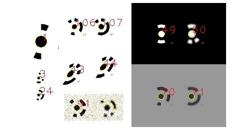

# Marker Detection

This C++ project provides a high-performance solution for the detection of photogrammetric circular markers (coded and uncoded) in images. The project was developed, refined and expanded as part of multiple research projects (see [Cite](#cite)) at the [TU Dresden](https://tu-dresden.de/bu/umwelt/geo/ipf/photogrammetrie) and [HTW Dresden](http://www.photogrammetrie.de/). **While the code has been validated in various scenarios, it may still contain bugs. Please use it with caution.**



## Limitations
 - The ID of the markers may be wrong, especially in case of noisy or blurry images and for small markers.
 - No standard deviation of the ellipse fit is returned.
 - Detection works only on 8-bit grayscale images.

## Getting Started
The only dependency is OpenCV.

### Install (Windows)
Use Visual Studio and VCPKG for dependency.
- Make sure VCPKG is integrated in Visual Studio, if not run ```vcpkg integrate install```
- In Visual Studio go to `File->Open->CMake...` and select `CMakeList.txt`
- Dependencies will be installed automatically.

### Executable
The executable is a simple example on how to use the code (see [main.cpp](main.cpp)). It will detect markers in all images of one directory and save coordinates to text file.
```
./marker_detection <directory path> [0/1 (view detected markers)]
```

### Library
For using the marker detection in your code only one function has to be called.

``` cpp
// Reading image
cv::Mat image = cv::imread("image path", cv::IMREAD_GRAYSCALE);

// Detection parameters
marker_detection::Parameter param;

// Detecting markers
std::vector<marker_detection::Ellipse> detected_markers;
marker_detection::detectAndDecode(image, detected_markers, param);
```

## Parameters
Using the struct ```marker_detection::Parameter``` the detection process can controlled. In general most parameters should not be changed. The following parameters may be helpful for adapting the detection process to a specific dataset.

| Parameter (default) | Description |
|---|---|
| marker_min_diameter (8)		| Minimum diameter of marker in pixels. |
| marker_max_diameter (300)		| Maximum diameter of marker in pixels. |
| marker_min_contrast (30)		| Minimum contrast between marker and surrounding area. |
| max_ellipse_ratio (3)			| Maximum ratio between a and b (ratio = a/b). |
| return_uncoded_marker (true)	| If true, markers without code will be returned (with marker ID = -1). |
| detect_coded_marker (true)	| If true, coded markers will searched. |
| median_blur_kernel (5)		| Kernel size of the median blur filter (disable with -1). This will be used for the initial edge detection, not the sub-pixel measurement. |
| blur_kernel (-1)				| Kernel size of blur filter (averaging, disable with -1). This will be used for the initial edge detection, not the sub-pixel measurement. |
| robust_ellipse_fit (true)		| Robust ellipse fit, will result in longer processing (see: https://doi.org/10.1016/j.isprsjprs.2021.04.010). |
| min_distance_closest_point (1.0) | Threshold for returning points in close proximity. Parameter is multiplied with a for uncoded markers and with 3*a for coded markers. Set to <0 for returning all points. |
| max_marker_value_rmse(15)     | Maximum RMSE of the pixel values inside of the marker. |
| max_surrounding_value_rmse(100)| Maximum RMSE of the pixel values around of the marker. |

### Sub-pixel Methods
To increase the precision of the marker coordinates sub-pixel measurement methods can be used. **Note: For large markers the improvement may be small or non-existent.**

- `sub_pixel_method = 0` No sub-pixel measurement. Method: Edge pixel will be used to fit ellipse. Accuracy of < 0.3 pixels can be expected, especially for large markers.
- `sub_pixel_method = 1` Default: Star-operator. Method: From the initial ellipse sub-pixel values along multiple scan lines (see parameter: `sub_pixel_scan_lines`) are extracted. Accurate edge position is determined using moment preservation [(Tabatabai and Mitchell 1984)](https://ieeexplore.ieee.org/document/4767502). Position is refined in multiple iterations (see `sub_pixel_iterations`).
- `sub_pixel_method = 2` Zhou-operator (without weights). Method: For each edge pixel, surrounding pixels in x and y directions are extracted and moment preservation is performed for more accurate positions. For each direction, line fit (`cv::fitline()`) is performed and the new position is given by the intersection of lines. Position is refined in multiple iterations  (see `sub_pixel_iterations`). Only working for larger markers.

In case of `sub_pixel_method = 1` the parameter `marker_contrast_consistency` can be used to filter the edge points. Consistency of contrast at the edge of the marker. 0 = inconsistent contrast around marker, 1 = same contrast at edge of marker.


### Image Threshold Methods
In some cases thresholding the image before the edge detection may be helpful to avoid missing markers in dark or bright areas. By default, this is not used.

- `threshold_method = 0` Default: No threshold (direct Canny edge detection on image).
- `threshold_method = 1` OpenCV `cv::threshold()` with `cv::THRESH_OTSU`.
- `threshold_method = 2` Adaptive Thresholding Method. D. Bradley and G. Roth, “Adaptive Thresholding using the Integral Image,” Journal of Graphics Tools, vol. 12, Art. no. 2, Jan. 2007, doi: [10.1080/2151237x.2007.10129236](https://www.tandfonline.com/doi/abs/10.1080/2151237X.2007.10129236).
- `threshold_method = 3` CLAHE histogram equalization. Use `clahe_clip_limit` to change result.
- `threshold_method = 4` Image normalization. Use `sigma_1` and `sigma_2` for adjustment. Option will increase processing time. See: [link1](https://de.mathworks.com/matlabcentral/fileexchange/8303-local-normalization), [link2](https://stackoverflow.com/questions/14872306/local-normalization-in-opencv)

### Edge Methods
Two methods can be used for edge detection. 
- `edge_method = 0` Default: Edges are extracted using Canny edge detection.
- `edge_method = 1` Using `cv::adaptiveThreshold()` and thinning of the edge afterwards. Relatively slow.

### Codes
12bit and 14bit codes can be decoded (set option `code_bits=12` or `code_bits=14`). The code ID´s are generated based on the work of [Matthew Petroff](https://mpetroff.net/2018/05/photogrammetry-markers/) and compatible to **AICON 3D Studio**. To detect 8bit, 10bit, 16bit, ... markers only small changes to the code are necessary (see [codes.h](codes.h)). From the center of the marker the code ring starts usually at `2*radius` and ends at `3*radius`, the search radius for the code is `2.5` by default and can be changed using the option `code_ring_radius`.

If **Agisoft Metashape** was used to generate the markers set option `use_metashape_codes=true` and `code_ring_radius=2.875`. In Metashape the code starts at `2.25*radius` and ends at `3.5*radius`.  For decoding fixed look up tables are used and only 12bit and 14bit codes are supported (see [codes.h](codes.h)). 

## Background
### Summary Detection Process
The general detection process follows these steps. Some of these steps can be disabled, and additional checks are performed to filter the results:
1. A blur filter is applied to the image to reduce noise and enhance edge detection.
1. The image is thresholded to improve edge detection.
1. Edge detection is performed to identify marker boundaries
1. Connected edge points are grouped.
1. An ellipse is fitted to the connected edge points.
1. Sub-pixel measurement is performed on original image.
1. The robust ellipse-fitting algorithm refines the initial fit to handle outlier edge points.
1. Codes are detected in the original image to identify markers.

### Image Coordinate System
The origin of the image coordinate system (0,0) is located in the **CENTER** of the top-left pixel.

|   | Definition |
|---|---|
|OpenCV		| Center of the top-left pixel is (0,0); May be different for some parts of the library. |
|Metashape  | Center of the top-left pixel is (0.5,0.5); Tested using marker detection. |
|Matlab		| Center of the top-left pixel is (1,1); https://www.mathworks.com/help/images/image-coordinate-systems.html |

### Precision and Accuracy
To determine the accuracy of a marker detection method, the true coordinates must be known. Alternatively, the precision of the results can be determined by comparison with other methods. Accuracy depends significantly on test data, including factors like image noise, marker size, contrast, focus, and viewing angle.

The precision was investigated using a set of images in comparison with two other methods available in commercial software (Aicon 3D Studio and Agisoft Metashape). The precision of this method using the default settings is comparable to both commercial programs. Across 7836 measured markers, the mean distance of this method was 0.05 pixels compared to Aicon 3D Studio and 0.11 pixels compared to Metashape. The mean distance between the same markers in the commercial programs was 0.12 pixels.

More information on the test data, the method used, and additional accuracy investigations can be found in [accuracy.md](accuracy.md)

### Debugging
For identifying problems with the detection process, additional information can be returned using the optional debug argument. When this argument is used, additional data will be also attached to each ellipse.

``` cpp
marker_detection::DetectionDebug debug;
std::vector<marker_detection::Ellipse> detectedmarkers;
marker_detection::detectAndDecode(image_gray, detectedmarkers, marker_detection::Parameter(), &debug);
```
## Cite
<a name="cite"></a>
If this project contributes to your research, please consider citing one of the following papers.

```
@Article{isprs-archives-XLIII-B2-2022-679-2022,
AUTHOR = {Hardner, M. and Docea, R. and Schneider, D.},
TITLE = {GUIDED CALIBRATION OF MEDICAL STEREO ENDOSCOPES},
JOURNAL = {The International Archives of the Photogrammetry, Remote Sensing and Spatial Information Sciences},
VOLUME = {XLIII-B2-2022},
YEAR = {2022},
PAGES = {679--686},
URL = {https://isprs-archives.copernicus.org/articles/XLIII-B2-2022/679/2022/},
DOI = {10.5194/isprs-archives-XLIII-B2-2022-679-2022}
}

@Article{s24165139,
AUTHOR = {Hardner, Matthias and Liebold, Frank and Wagner, Franz and Maas, Hans-Gerd},
TITLE = {Investigations into the Geometric Calibration and Systematic Effects of a Micro-CT System},
JOURNAL = {Sensors},
VOLUME = {24},
YEAR = {2024},
NUMBER = {16},
ARTICLE-NUMBER = {5139},
URL = {https://www.mdpi.com/1424-8220/24/16/5139},
PubMedID = {39204836},
ISSN = {1424-8220},
DOI = {10.3390/s24165139}
}

```

## Further Information
- Python marker generation: https://github.com/natowi/14-Bit-Circular-Coded-Target (tested, code compatible)
	- Fork with custom A4 sheets: https://github.com/matthiashar/14-Bit-Circular-Coded-Target-Generation
- Python marker decoding: https://github.com/poxiao2/CCTDecode (not tested)
- General Information: https://mpetroff.net/2018/05/photogrammetry-targets/
- Patent: https://patents.google.com/patent/DE19733466A1/en?oq=+DE19733466A1
- Matlab Code: https://de.mathworks.com/matlabcentral/fileexchange/156647-coded-photogrammetric-markers/?s_tid=mlc_lp_leaf
