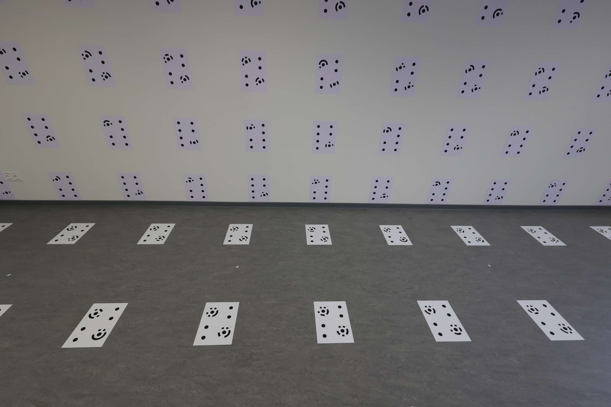
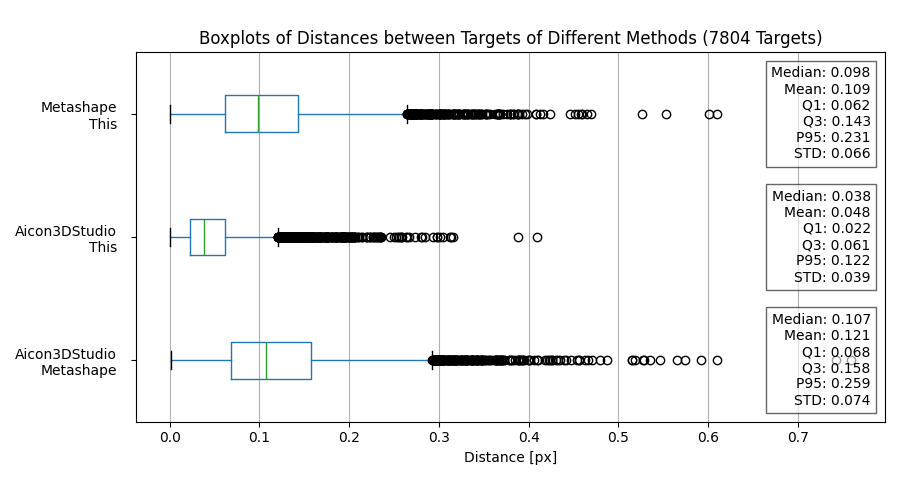
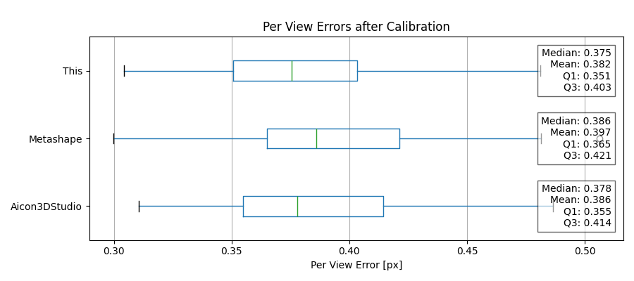

# Precision and Accuracy
## Precision by Comparison to other Methods

By comparing the coordinates from two different methods, no definitive statement can be made on the accuracy of either individual method. Instead, the comparison shows how well the target coordinates from the two methods agree with each other.

## Accuracy by Camera Calibration

The accuracy of the target detection can be estimated through camera calibration. During calibration, both intrinsic and extrinsic parameters are adjusted, and the remaining errors indicate how well the detected targets fit the camera model. The residual error thus represents a combination of the target detection error and additional errors that arise from the model's limitations in representing the data.

**Additional Causes of Error after Calibration:**
- Camera instabilities
- Inadequate camera model (e.g., insufficient or incorrect distortion parameters)
- Incorrect object point coordinates (if not adjusted during calibration)

Because of this, the absolute accuracy value cannot be determined. However, by comparing multiple methods, the most accurate method can be identified. It is important to note that for such comparisons, the same points from the same dataset must be used.

## Investigation on Test Data Set

### Data

The test dataset, consisting of 200 images, was captured with a Canon R6 and a 16 mm lens (exposure: 1/100, f/8, ISO: between 1000 and 5000). The average target size is 12.6 pixels for the ellipse major axis, with an average aspect ratio of 1.4. The images are mostly in focus, exhibit minimal image noise, and contain no motion blur.

## Precision

Target detection was performed on all images using Agisoft Metashape, Aicon 3D Studio, and this method. For all targets detected by all methods, the Euclidean distance between each target was calculated. Distances greater than 10 pixels were excluded. The average distance between targets detected by Aicon 3D Studio and this method was the smallest, at 0.048 pixels. Comparisons between targets detected by Metashape and the other methods resulted in average distances slightly above 0.1 pixels.

## Accuracy
To estimate the accuracy of the detected targets from the different methods, calibrations were performed using the OpenCV function calibrateCamera(). The parameters fx, fy, cx, and cy, as well as five distortion parameters, were adjusted. Object point coordinats were not adjusted.

**Note:** This method of determining accuracy relies on the camera model used and how well the observations fit this model. In the case of camera instabilities, distortion not modeled by the selected parameters, or incorrect object point coordinates, the errors will increase. However, since these issues affect all target detection methods equally, the errors are still comparable. **The absolute values should not be taken as the accuracy of the target detection methods.**

For the calibrations, 40 images with 1512 observed targets were used. The resulting perViewErrors are visualized in a boxplot.

